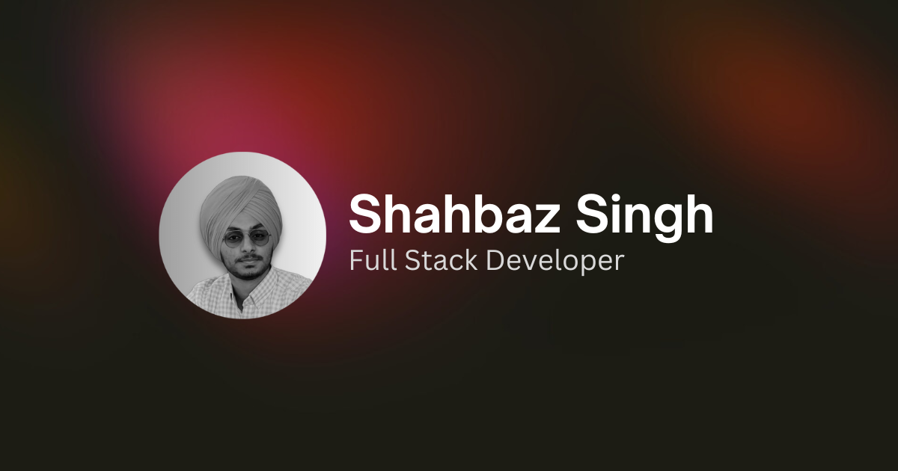

# Personal Portfolio & Blog

> A minimalist showcase of my work, thoughts, and music taste



---

## Table of Contents

- [Overview](#overview)
- [Demo](#demo)
- [Features](#features)
- [Tech Stack](#tech-stack)
- [Getting Started](#getting-started)
  - [Prerequisites](#prerequisites)
  - [Installation](#installation)
  - [Configuration](#configuration)
  - [Running Locally](#running-locally)
- [Usage](#usage)
- [Project Structure](#project-structure)
- [Deployment](#deployment)
- [Contributing](#contributing)
- [License](#license)

---

## Overview

Welcome to my personal corner of the internet. This repository houses a clean, fast, and responsive portfolio & blog built with Next.js. Here you can:

- Browse my **project showcase** and **professional experience timeline**
- Read my **blog posts** with live view counters and likes
- Discover what I’m currently listening to and my top tracks/artists via **Spotify integration**

I built this platform to combine my passions for **software development**, **technical writing**, and **music discovery**.

---

## Demo

Live site: [https://your-domain.com](https://your-domain.com)

---

## Features

### Core
- 🎨 **Minimalist Design**: Focus on content, reduce visual clutter
- 📱 **Responsive Layout**: Optimized for mobile, tablet, and desktop
- ⚡ **Performance**: Server-side rendering and image optimization
- 🌙 **Dark/Light Mode**: User preference detection and manual toggle

### Projects & Experience
- 💼 **Project Showcase**: Filter and sort by technology, date, or category
- 📝 **Experience Timeline**: Chronological display of roles and achievements

### Blog
- 📝 **Markdown Support**: Write posts in MDX with embedded React components
- 🔍 **Syntax Highlighting**: Automatic code block formatting
- 📊 **Real‑time Analytics**:
  - View counter powered by Redis
  - Like button with interaction tracking
- 🖼️ **Optimized Images**: Responsive, lazy‑loaded images for all posts
- 🔎 **SEO Optimized**: Auto‑generated metadata, sitemap, and Open Graph tags

### Spotify Integration
- 🎵 **Current Listening Status**: Shows what track you’re playing live
- 📈 **Top Tracks & Artists**: Weekly, monthly, all-time stats
- 🔁 **Recently Played**: Chronological list of your last 50 plays

---

## Tech Stack

- **Framework**: Next.js (App Router + Server Components)
- **Language**: TypeScript
- **Styling**: Tailwind CSS + PostCSS
- **Animation**: Framer Motion
- **Data Store**: Redis (for counters)
- **API**: Spotify Web API
- **Deployment**: Vercel

---

## Getting Started

Follow these steps to spin up a local copy for development and testing.

### Prerequisites

- Node.js v18+
- npm or yarn
- Redis instance (local or managed)
- Spotify Developer account

### Installation

```bash
# Clone the repo
git clone https://github.com/yourusername/portfolio-blog.git
cd portfolio-blog

# Install dependencies
npm install
# or
yarn install
```

### Configuration

Create a `.env.local` file at the project root with these variables:

```bash
# Spotify API Credentials
SPOTIFY_CLIENT_ID=your_spotify_client_id
SPOTIFY_CLIENT_SECRET=your_spotify_client_secret

# Redis URL
REDIS_URL=redis://localhost:6379

# Optional: Analytics
NEXT_PUBLIC_GOOGLE_ANALYTICS_ID=UA-XXXXX-X
```

### Running Locally

```bash
# Start development server
npm run dev
# or
yarn dev
```

Open [http://localhost:3000](http://localhost:3000) in your browser.

---

## Usage

- **Add a new blog post**: Create an MDX file in `content/posts` and restart the server.
- **Manage projects**: Update the JSON/YAML in `data/projects.yml`.
- **Redis counters**: Ensure your Redis instance is running before starting the app.
- **Spotify data**: The server-side `recentlyPlayed` function polls the API on request.

---

## Project Structure

```
├── app/
│   ├── layout.tsx        # Root layout with theme provider
│   ├── page.tsx          # Homepage with project & blog sections
│   └── spotify/          # Server functions for Spotify integration
├── components/           # Reusable UI components
├── content/              # MDX blog posts
├── data/                 # Static JSON/YAML for projects & experience
├── lib/                  # Helpers (normalizers, API clients)
├── public/               # Static assets (images, fonts)
├── styles/               # Global CSS & Tailwind config
└── scripts/              # Utility scripts (e.g. RSS feed)
```

---

## Deployment

This project is optimized for Vercel. Simply connect your GitHub repo, set the same environment variables in the Vercel dashboard, and deploy.

---

## Contributing

Contributions are welcome! Please open an issue or submit a pull request:

1. Fork the repository
2. Create a new branch (`git checkout -b feature/YourFeature`)
3. Commit your changes (`git commit -m 'Add new feature'`)
4. Push (`git push origin feature/YourFeature`)
5. Open a Pull Request

Be sure to follow the existing code style and include tests for new functionality.

---

## License

This project is licensed under the [MIT License](LICENSE).
